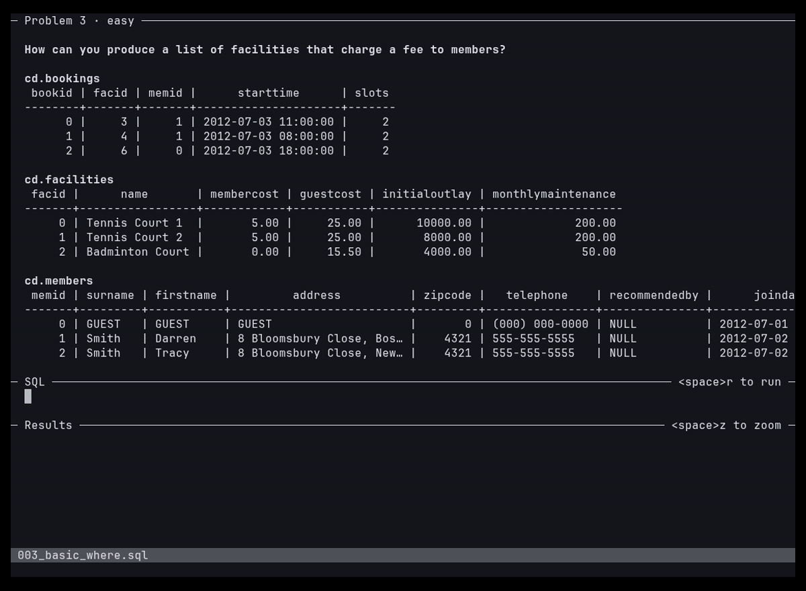

# sqlgym

Practice SQL interview problems from the terminal, in your editor, against DuckDB.



Needs [Neovim](https://neovim.io) 0.10+ and [uv](https://docs.astral.sh/uv/).

```sh
uv tool install git+https://github.com/azure-eller/sqlgym
sqlgym               # open the next unsolved problem
sqlgym open 107      # open a specific problem
sqlgym list          # all problems and your progress
sqlgym check FILE    # check a file's last query from the shell
```

`sqlgym` opens Neovim with three panes stacked top to bottom: the problem, your
SQL, and the results. The problem and SQL panes size themselves to fit and the
results get the rest.

| Key | |
|---|---|
| `<leader>r` | run your query and check it |
| `<leader>n` | next problem (skips this one if unsolved) |
| `<leader>a` | show the answer |
| `<leader>R` | redo: clear your SQL (`u` undoes) |
| `<leader>z` | zoom the results to full screen to scroll a big table; again to go back |
| `:q` | save and quit |

The same actions are available as `:Sqlgym run|next|answer|redo`. The keys use
your own leader and exist only in sqlgym's buffers, so your Neovim config is
never changed. In those buffers sqlgym also turns off format-on-save,
completion popups and sqlfluff linting, which get in the way of practice.

Only the **last** statement in your SQL is checked, so you can keep scratch
queries above your answer. Wide tables and results scroll sideways (`zl` / `zh`).

Progress lives in `~/.local/share/sqlgym/progress.json` and your answers in
`~/.local/share/sqlgym/work/<NNN_slug>.sql` (respects `$XDG_DATA_HOME`).

## Adding a problem

```
problems/<NNN_slug>/
  problem.toml   # title, difficulty, ordered (default false)
  prompt.md      # the question text
  setup.sql      # CREATE TABLE + INSERT statements
  solution.sql   # reference answer
```

The schema and sample rows shown with each problem are generated from `setup.sql`.
Run `uv run pytest` to check that every solution runs and returns rows.

Problems 001–099 come from [pgexercises](https://github.com/AlisdairO/pgexercises)
and are regenerated by `uv run scripts/import_pgexercises.py`, which writes
`scripts/import_report.md`. Problems 101+ are original.
